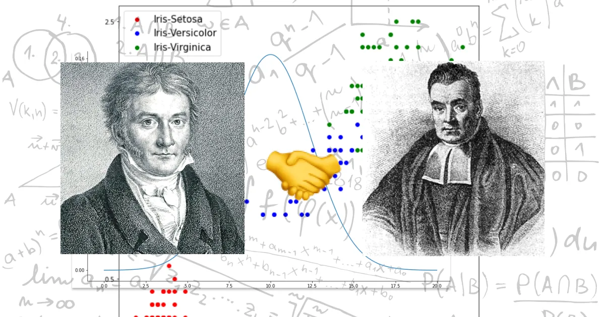

# Bayesian Linear Nerual Network for Regression

## 贝叶斯方法

> 贝叶斯定理是一个数学定理，它解释了为什么如果世界上所有的汽车都是蓝色的，那么我的汽车也必须是蓝色的，但仅仅因为我的汽车是蓝色的，并不意味着世界上所有的汽车都是蓝色的。

前馈神经网络（最简单的深度学习结构）通过将输入乘以参数矩阵来处理您的输入。然后将非线性激活函数（**这是神经网络的真正威力**）逐项应用于该矩阵乘法的结果。

下面我们使用 $\omega$ 表示模型参数， $\mathbf{x}$ 表示训练数据：

$$
P(\omega_i | \mathbf{x}) = \frac{P(\mathbf{x} | \omega_i)\times P(\omega_i)}{P(\mathbf{x})}
$$

---

## 概率分布的度量

相对熵又被成为KL散度，或信息散度，用来度量两个概率分布间的非对称性差异，在信息论中KL相对熵等于两个概率分布的信息熵的差值。

设 $P(x)、Q(x)$ 是离散随机变量 $X$ 中取值 $x$ 的两个概率分布函数，它们的结果分别为 $p$ 和 $q$ ，则 $p$ 对 $q$ 的相对熵如下：

$$
D_{KL} = \sum_{x\in X}^{}P(x)log\frac{P(x)}{Q(x)}=E_p\left [ log\frac{dP(x)}{dQ(x)} \right ]
$$

由该式可知当两个分布相同时，相对熵为0并且相对熵具有不对称性。

将上式中的对数部分展开，可以看到相对熵与绝对熵之间的关系：

$$
D_{KL}(p||q)=\sum_{x \in X}^{}P(x)logP(x) + \sum_{x \in X}^{}P(x)log\frac{1}{Q(x)}  \newline 
=-H(p)+H_{cross}(p, q)\newline =H_{cross}(p,q)-H(p)
$$

---

## 使用贝叶斯线性网络完成回归

~~~python
import numpy as np
from tqdm import tqdm
import matplotlib.pyplot as plt

import torch
import torch.nn as nn
import torch.optim as optim
import torchbnn as bnn

import warnings

warnings.filterwarnings("ignore")

class BayesianNetwork4Regression(nn.Module):
    """用于回归任务的贝叶斯全连接网络"""

    def __init__(self, prior_mu=0, prior_sigma=0.1,
                 in_features=1, hidden_features=250, out_features=1,
                 kl_weight=0.1, lr=0.01, weight_decay=0):
        super(BayesianNetwork4Regression, self).__init__()
        
        # 定义使用的贝叶斯神经网络
        self.model = nn.Sequential(
            bnn.BayesLinear(prior_mu=prior_mu, prior_sigma=prior_sigma,
                            in_features=in_features, out_features=hidden_features),
            nn.ReLU(),
            bnn.BayesLinear(prior_mu=prior_mu, prior_sigma=prior_sigma,
                            in_features=hidden_features, out_features=out_features),
        ).double()

        # 与训练相关
        self.kl_weight = kl_weight
        self.lr = lr
        self.weight_decay = weight_decay

        # 训练使用的数据 Tensor和ndarray两种形式
        self.X_train, self.y_train = None, None
        self.X_numpy, self.y_numpy = None, None
        # 拟合数据的ndarray形式
        self.Xfit, self.yfit = None, None

    @staticmethod
    def _data_prepare(data):
        # 数据准备函数 将Numpy数组转化可以利用的张量
        if isinstance(data, np.ndarray):
            data = torch.from_numpy(data)
        # 判断其维度
        if len(data.size()) == 1:
            data = torch.unsqueeze(data, dim=1)
        return data.double()

    def _data_refresh(self, X, y):
        # 每次fit都会更新现在正在使用的数据
        self.X_train, self.y_train = X, y
        self.X_numpy, self.y_numpy = X.data.numpy(), y.data.numpy()

    def fit(self, X, y, num_epochs=3000):
        """
        模型训练的函数
        :param X: 训练样本
        :param y: 训练标签
        :param num_epochs: 训练的轮数,最好在3000以上
        :return: None
        """
        # 准备好数据
        X, y = self._data_prepare(data=X), self._data_prepare(data=y)
        self._data_refresh(X=X, y=y)
        print("X:", X.size(), "y:", y.size())

        mse_loss = nn.MSELoss()
        kl_loss = bnn.BKLLoss(reduction='mean', last_layer_only=False)
        kl_weight = self.kl_weight
        optimizer = optim.Adam(self.model.parameters(), lr=self.lr,
                               weight_decay=self.weight_decay)
        # 开始网络的训练
        for _ in tqdm(range(num_epochs)):
            # 数据正向传播
            pre = self.model(X)
            # 计算均方误差
            mse = mse_loss(pre, y)
            # 计算模型的KL散度
            kl = kl_loss(self.model)
            # 贝叶斯网络的损失由两部分共同组成
            cost = mse + kl_weight * kl
            # 清空原本的梯度并进行误差的反向传播
            optimizer.zero_grad()
            cost.backward()
            optimizer.step()
        print('MSE : %2.5f, KL : %2.5f' % (mse.item(), kl.item()))

    def predict(self, Xfit):
        """
        进行结果预测的函数
        :param Xfit: 进行预测的数据,通常为linspace的结果
        :return: yfit
        """
        Xfit = self._data_prepare(data=Xfit)
        yfit = self.model(Xfit)
        self.Xfit = Xfit.data.numpy()
        self.yfit = yfit.data.numpy()
        return self.yfit

    def plotX(self, title='Bayesian Neural Network Regression', title_size=18,
              x_label='x', y_label='y', xy_size=15, figsize=(8, 5),
              color_scatter='royalblue', color_line='tomato', alpha=0.8, lw=2):
        """结果的可视化"""
        fig, ax = plt.subplots(figsize=figsize)
        plt.style.use('seaborn-whitegrid')
        # 绘制拟合数据的散点
        ax.scatter(self.X_numpy, self.y_numpy, color=color_scatter, alpha=alpha)
        # 绘制拟合的模型曲线
        ax.plot(self.Xfit, self.yfit, color=color_line, lw=lw)
        # 设置标题与坐标轴
        ax.set_title(title, fontsize=title_size)
        ax.set_xlabel(x_label, fontsize=xy_size)
        ax.set_ylabel(y_label, fontsize=xy_size)
        # 添加图例
        ax.legend(["Train Dataset", "BayesianRegression"], loc='best',
                  frameon=True, shadow=True, fontsize=xy_size - 2)
        # 添加黑色边框
        for spine in ax.spines.values():
            spine.set_edgecolor("black")
            spine.set_linewidth(0.5)
        return fig
~~~

